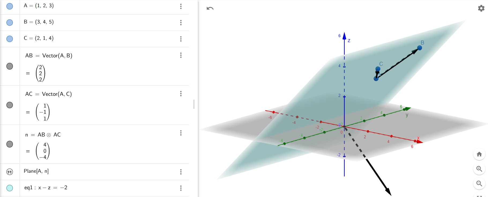

## 16. Equations of planes in space

* The plane passes through points $A(1, 2, 3)$, $B(3, 4, 5)$, and $C(2, 1, 4)$. Find the equation of the plane.

To find the equation of the plane passing through the points A(1, 2, 3), B(3, 4, 5), and C(2, 1, 4):

1. Find the vectors:
   AB = (2, 2, 2),  AC = (1, -1, 1)

2. Compute the normal vector n:
   n = AB x AC = (4, 0, -4)

3. The equation of the plane is:
   4(x - 1) + 0(y - 2) - 4(z - 3) = 0

   Simplifying:
   x - z = -2

Thus, the equation of the plane is:
x - z = -2
