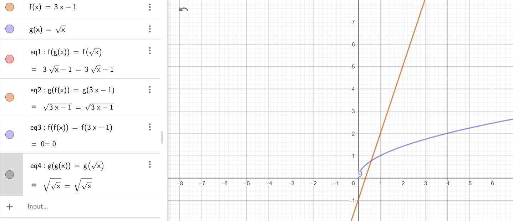

## 16. Equations of planes in space

* The plane passes through points $A(1, 2, 3)$, $B(3, 4, 5)$, and $C(2, 1, 4)$. Find the equation of the plane.

To find the equation of the plane passing through the points A(1, 2, 3), B(3, 4, 5), and C(2, 1, 4):

1. Find the vectors:
   AB = (2, 2, 2),  AC = (1, -1, 1)

2. Compute the normal vector n:
   n = AB x AC = (4, 0, -4)

3. The equation of the plane is:
   4(x - 1) + 0(y - 2) - 4(z - 3) = 0

   Simplifying:
   x - z = -2

Thus, the equation of the plane is:
x - z = -2

* The plane passes through point $A(1, 2, 3)$ and is parallel to the plane $2x + 3y + 4z = 5$. Find the equation of the plane.

To find the equation of the plane passing through point A(1, 2, 3) and parallel to the plane 2x + 3y + 4z = 5:

1. The normal vector of the given plane is the same as the normal vector of the new plane because they are parallel.  
   Normal vector of the given plane = (2, 3, 4).

2. The equation of the new plane is in the form:  
   2(x - 1) + 3(y - 2) + 4(z - 3) = 0

3. Simplifying:
   2x - 2 + 3y - 6 + 4z - 12 = 0

   2x + 3y + 4z - 20 = 0

Thus, the equation of the plane is:
2x + 3y + 4z = 20

* The plane passes through point $A(1, 2, 3)$ and is perpendicular to the normal vector $\mathbf{n} = [2, 3, 4]$. Find the equation of the plane.

To find the equation of the plane passing through point A(1, 2, 3) and perpendicular to the normal vector n = [2, 3, 4]:

1. The equation of the plane is given by:
   n₁(x - x₁) + n₂(y - y₁) + n₃(z - z₁) = 0

2. Using point A(1, 2, 3) and the normal vector n = [2, 3, 4], the equation becomes:
   2(x - 1) + 3(y - 2) + 4(z - 3) = 0

3. Simplifying:
   2x - 2 + 3y - 6 + 4z - 12 = 0

   2x + 3y + 4z = 20

Thus, the equation of the plane is:
2x + 3y + 4z = 20

* We have two planes $2x + 3y + 4z = 5$ and $3x + 4y + 2z = 6$. Find the line of intersection of these planes.

We have two planes:  
Plane 1: 2x + 3y + 4z = 5  
Plane 2: 3x + 4y + 2z = 6  

1. Find the direction of the line by computing the cross product of the normal vectors of the planes:  
   Normal vector of Plane 1: (2, 3, 4)  
   Normal vector of Plane 2: (3, 4, 2)

   Cross product:  
   `n1 x n2 = (-4, 6, -2)`

   So, the direction vector of the line is (-4, 6, -2).

2. Find a point on the line by solving the system of equations:  
   Plane 1: 2x + 3y + 4z = 5  
   Plane 2: 3x + 4y + 2z = 6  

   Solving for x, y, and z (for example, by setting z = 0):  
   x = 1, y = 1, z = 0.  
   
   Thus, the point on the line is (1, 1, 0).

3. The parametric equations of the line are:  
   `x = 1 - 4t`  
   `y = 1 + 6t`  
   `z = -2t`

Thus, the line of intersection is:  
`(x, y, z) = (1 - 4t, 1 + 6t, -2t)`  
where t is the parameter.

* Write the equation of the plane passing through point $A(1, 2, 3)$ and parallel to vectors $\vec{v_1} = [1, 0, 1]$ and $\vec{v_2} = [0, 1, -1]$.

### Equation of the Plane Passing Through Point A(1, 2, 3) and Parallel to Vectors v1 = [1, 0, 1] and v2 = [0, 1, -1]:

1. **Define Point A and Vectors**:
   - Point A(1, 2, 3)
   - Vector v1 = (1, 0, 1)
   - Vector v2 = (0, 1, -1)

2. **Calculate the Normal Vector**:
   The normal vector n is given by the cross product v1 × v2:
   n = v1 × v2 = (-1, 1, 1)

3. **Equation of the Plane**:
   Using the point A(1, 2, 3) and the normal vector n = (-1, 1, 1), the equation of the plane is:
   -1(x - 1) + 1(y - 2) + 1(z - 3) = 0

4. **Simplifying**:
   x - y - z = -4

Thus, the equation of the plane is:
x - y - z = -4

* We have the plane $2x + 3y + 4z = 5$. Find an example of a plane parallel and perpendicular to it.

### Given Plane
The equation of the given plane is:  
**2x + 3y + 4z = 5**

The normal vector of this plane is **(2, 3, 4)**.

### Parallel Plane
A plane parallel to the given plane will have the same normal vector. For example, for **d = 10**:

**2x + 3y + 4z = 10**

### Perpendicular Plane
To find a perpendicular plane, its normal vector must be perpendicular to **(2, 3, 4)**.  
By solving **2a + 3b + 4c = 0**, we get **a = 1, b = -1, c = 0**, resulting in the equation:

**x - y = 3**

### Summary
- **Parallel Plane**: 2x + 3y + 4z = 10  
- **Perpendicular Plane**: x - y = 3

* We have the plane $2x + 3y + 4z = 5$ and point $A(1, 2, 3)$. Find the distance from point $A$ to this plane.

### Given Plane
The equation of the given plane is:  
**$2x + 3y + 4z = 5$**

The point is $A(1, 2, 3)$.

### Distance Formula
The distance from a point $(x_1, y_1, z_1)$ to a plane $ax + by + cz = d$ is given by:  

$$
d = \frac{|ax_1 + by_1 + cz_1 - d|}{\sqrt{a^2 + b^2 + c^2}}
$$

### Calculation
Substitute the values into the formula:
- $a = 2, b = 3, c = 4, d = 5$
- Point $A(1, 2, 3)$ gives $x_1 = 1, y_1 = 2, z_1 = 3$

Thus, the distance is:

$$
d = \frac{|2(1) + 3(2) + 4(3) - 5|}{\sqrt{2^2 + 3^2 + 4^2}} = \frac{|15|}{\sqrt{29}} = \frac{15}{\sqrt{29}} \approx 2.79
$$

### Final Answer
The distance from point $A(1, 2, 3)$ to the plane $2x + 3y + 4z = 5$ is approximately:  

**2.79**

* The plane intersects the coordinate axes at points $A(2, 0, 0)$, $B(0, 3, 0)$, and $C(0, 0, 4)$. Find the equation of the plane.

### Given Points
- $A(2, 0, 0)$
- $B(0, 3, 0)$
- $C(0, 0, 4)$

### Equation of the Plane
The equation of the plane is:

$$
6x + 4y + 3z = 12
$$

* Calculate the angle between the plane $x + y + z = 1$ and the plane $x = 0$ (i.e., the $yz$ plane).

### Given Planes
- Plane 1: $x + y + z = 1$
- Plane 2: $x = 0$ (the $yz$-plane)

### Normal Vectors
- Normal vector of Plane 1: $\mathbf{n_1} = (1, 1, 1)$
- Normal vector of Plane 2: $\mathbf{n_2} = (1, 0, 0)$

### Dot Product and Magnitudes
- Dot product: $\mathbf{n_1} \cdot \mathbf{n_2} = 1$
- Magnitude of $\mathbf{n_1}$: $|\mathbf{n_1}| = \sqrt{3}$
- Magnitude of $\mathbf{n_2}$: $|\mathbf{n_2}| = 1$

### Angle Calculation
Using the formula:

$$
\cos(\theta) = \frac{|\mathbf{n_1} \cdot \mathbf{n_2}|}{|\mathbf{n_1}| |\mathbf{n_2}|} = \frac{1}{\sqrt{3}}
$$

Thus, the angle $\theta$ is:

$$
\theta = \cos^{-1}\left(\frac{1}{\sqrt{3}}\right) \approx 54.74^\circ
$$

* Find the vector perpendicular to the plane $x + y + z = 1$.

### Given Plane
- Plane equation: $x + y + z = 1$

### Normal Vector
The normal vector to the plane is given by the coefficients of $x$, $y$, and $z$ in the equation. Therefore, the normal vector is:

$$
\mathbf{n} = (1, 1, 1)
$$

## 17. Equations of second-order surfaces

* Write the equation of a sphere with center at point $P=(1,2,3)$ and radius $r=3$.

### Given
- Center: $P = (1, 2, 3)$
- Radius: $r = 3$

### Equation of the Sphere
Substitute into the formula:

$$
(x - 1)^2 + (y - 2)^2 + (z - 3)^2 = 9
$$

* Do the spheres with equations $x^2 + y^2 + z^2 = 1$ and $x^2 + y^2 + z^2 = 2$ have any common points?

### Given
- Sphere 1: $x^2 + y^2 + z^2 = 1$ (center: $(0, 0, 0)$, radius: $1$)
- Sphere 2: $x^2 + y^2 + z^2 = 2$ (center: $(0, 0, 0)$, radius: $\sqrt{2}$)

### Analysis
- Both spheres are concentric (same center at $(0, 0, 0)$).
- The radius of Sphere 1 is smaller than that of Sphere 2 ($1 < \sqrt{2}$).

### Conclusion
Since one sphere is entirely inside the other, **there are no common points**.

* What curve in space is formed by the intersection of the sphere $x^2 + y^2 + z^2 = 1$ with the sphere $(x-1)^2 + y^2 + z^2 = 1$? Find the equation of this curve.

### Given Spheres
- Sphere 1: $x^2 + y^2 + z^2 = 1$ (center: $(0, 0, 0)$, radius: $1$)
- Sphere 2: $(x - 1)^2 + y^2 + z^2 = 1$ (center: $(1, 0, 0)$, radius: $1$)

### Step 1: Solve for $x$
Expanding the second sphere equation:
$$(x - 1)^2 + y^2 + z^2 = 1 \Rightarrow x^2 + y^2 + z^2 - 2x + 1 = 1$$

Substitute $x^2 + y^2 + z^2 = 1$:
$$1 - 2x + 1 = 1 \Rightarrow -2x + 1 = 0 \Rightarrow x = \frac{1}{2}$$

### Step 2: Equation of the Curve
Substitute $x = \frac{1}{2}$ into $x^2 + y^2 + z^2 = 1$:
$$\left(\frac{1}{2}\right)^2 + y^2 + z^2 = 1 \Rightarrow \frac{1}{4} + y^2 + z^2 = 1 \Rightarrow y^2 + z^2 = \frac{3}{4}$$

### Conclusion
The intersection curve is a circle in the plane $x = \frac{1}{2}$ with equation:
$$y^2 + z^2 = \frac{3}{4}$$

* Write the equation of the tangent plane to the paraboloid $z=(x-1)^2+y^2+1$ at point $P(1,0,1)$.

### Given
- Paraboloid: $z = (x - 1)^2 + y^2 + 1$
- Point: $P(1, 0, 1)$

### Step 1: Find the Partial Derivatives
- $f_x(x, y) = 2(x - 1)$
- $f_y(x, y) = 2y$

### Step 2: Evaluate at $P(1, 0)$
- $f_x(1, 0) = 2(1 - 1) = 0$
- $f_y(1, 0) = 2(0) = 0$

### Step 3: Equation of the Tangent Plane
Using the formula:
$z - z_0 = f_x(x_0, y_0)(x - x_0) + f_y(x_0, y_0)(y - y_0)$

Substitute $P(1, 0, 1)$:

$z - 1 = 0(x - 1) + 0(y - 0)$
Simplifies to:
z = 1

### Final Answer
The equation of the tangent plane is:
z = 1

## 18. Functions

### 1. Draw in a single Geogebra notebook the following functions:
   - $f(x) = x^2$
   - $g(x) = \sqrt{x}$
   - $h(x) = \frac{1}{x}$
   - $j(x) = \sin(x)$

Find value of all the above functions at $x = 2$.

### Given Functions
- $f(x) = x^2$
- $g(x) = \sqrt{x}$
- $h(x) = \frac{1}{x}$
- $j(x) = \sin(x)$

### Values at $x = 2$
- $f(2) = 2^2 = 4$
- $g(2) = \sqrt{2} \approx 1.414$
- $h(2) = \frac{1}{2} = 0.5$
- $j(2) = \sin(2) \approx 0.909$

### 2. Let $f(x) = 3x - 1$ and $g(x) = \sqrt{x}$. Find:
   - $f(g(x))$
   - $g(f(x))$
   - $f(f(x))$
   - $g(g(x))$

and visualize functions in a single Geogebra notebook.

### Given Functions
- $f(x) = 3x - 1$
- $g(x) = \sqrt{x}$

### Composite Functions
1. $f(g(x)) = 3\sqrt{x} - 1$
2. $g(f(x)) = \sqrt{3x - 1}$
3. $f(f(x)) = 9x - 4$
4. $g(g(x)) = x^{1/4}$

### 3. Let $f(x) = e^x$ and $g(x) = \ln(x)$. Check: $f(g(x))$ and $g(f(x))$. What do you notice?

### Given Functions
- $f(x) = e^x$
- $g(x) = \ln(x)$

### Composite Functions
1. $f(g(x)) = e^{\ln(x)} = x$
2. $g(f(x)) = \ln(e^x) = x$

### Conclusion
Both $f(g(x))$ and $g(f(x))$ simplify to $x$. This is because $e^x$ and $\ln(x)$ are inverse functions of each other.

### Observation
The compositions of these two functions result in the identity function $x$, meaning that applying one function after the other undoes the effect of the first. This demonstrates that the exponential and natural logarithm functions are inverses of each other.

### 4. We have function $f=\{(1,7), (2,9), (3,11)\}$. Give inverse function $f^{-1}$.

### Given Function
- $f = \{(1,7), (2,9), (3,11)\}$

### Inverse Function
- To find the inverse, we swap the coordinates of each pair:
  - $f^{-1} = \{(7,1), (9,2), (11,3)\}$

### Conclusion
- The inverse function is $f^{-1} = \{(7,1), (9,2), (11,3)\}$.

### 5. We have function $f=\{(1,7), (2,7), (3,11)\}$. Give inverse function $f^{-1}$.
### Given Function
- $f = \{(1,7), (2,7), (3,11)\}$

### Inverse Function
- For a function to have an inverse, it must be one-to-one (injective). In this case, both $f(1) = 7$ and $f(2) = 7$, so the function is not one-to-one.

### Explanation
- A function must be **injective (one-to-one)** for an inverse to exist. This means that every output (y-value) must correspond to exactly one input (x-value). If multiple inputs map to the same output, the function is not one-to-one, and no inverse can be defined.
- In this case, $f(1) = 7$ and $f(2) = 7$, meaning two different inputs (1 and 2) give the same output (7). Therefore, the function $f$ does not have an inverse.

### Conclusion
- The function $f$ does not have an inverse because it is not one-to-one.

### 6. We have function $f(x)= x-1$. Give inverse function $f^{-1}$. Show both functions on the same Geogebra notebook.

### Given Function
- $f(x) = x - 1$

### Inverse Function
- To find the inverse, solve for $x$ in terms of $y$:
  - $y = x - 1$
  - $x = y + 1$
  - So, the inverse function is $f^{-1}(x) = x + 1$.

### Conclusion
- The inverse function of $f(x) = x - 1$ is $f^{-1}(x) = x + 1$.

## 19. Limits of Sequences

### 1. Calculate:
   - $\displaystyle \lim_{n \to \infty} \frac{n^2 + 3n}{2 n^2 - 2n}$

   - $\displaystyle \lim_{n \to \infty} \frac{(2n+3)^3}{n^3-1}$

## solution

### 1. Calculate:

#### a) $\displaystyle \lim_{n \to \infty} \frac{n^2 + 3n}{2n^2 - 2n}$

To calculate the limit as $n \to \infty$, divide both the numerator and denominator by $n^2$:

$$
\frac{n^2 + 3n}{2n^2 - 2n} = \frac{1 + \frac{3}{n}}{2 - \frac{2}{n}}
$$

As $n \to \infty$, the terms $\frac{3}{n}$ and $\frac{2}{n}$ approach 0:

$$
\lim_{n \to \infty} \frac{n^2 + 3n}{2n^2 - 2n} = \frac{1 + 0}{2 - 0} = \frac{1}{2}
$$

#### b) $\displaystyle \lim_{n \to \infty} \frac{(2n+3)^3}{n^3 - 1}$

First, expand $(2n + 3)^3$:

$$
(2n + 3)^3 = 8n^3 + 12n^2 + 18n + 27
$$

Now, consider the limit:

$$
\frac{(2n+3)^3}{n^3 - 1} = \frac{8n^3 + 12n^2 + 18n + 27}{n^3 - 1}
$$

Divide both the numerator and denominator by $n^3$:

$$
\frac{8n^3 + 12n^2 + 18n + 27}{n^3 - 1} = \frac{8 + \frac{12}{n} + \frac{18}{n^2} + \frac{27}{n^3}}{1 - \frac{1}{n^3}}
$$

As $n \to \infty$, the terms $\frac{12}{n}$, $\frac{18}{n^2}$, $\frac{27}{n^3}$, and $\frac{1}{n^3}$ all approach 0:

$$
\lim_{n \to \infty} \frac{(2n+3)^3}{n^3 - 1} = \frac{8 + 0}{1 - 0} = 8
$$

### Final Answers:
- $\displaystyle \lim_{n \to \infty} \frac{n^2 + 3n}{2n^2 - 2n} = \frac{1}{2}$
- $\displaystyle \lim_{n \to \infty} \frac{(2n+3)^3}{n^3 - 1} = 8$

### 2. Prove using the squeeze theorem:
   - $\displaystyle\lim_{n \to \infty} \frac{\sin(n)}{n}$
## Solution
### Step-by-Step Solution:

1. **Find the Bounds for \( \sin(n) \):**
   We know that for all \( n \), \( \sin(n) \) is bounded by:
   $$
   -1 \leq \sin(n) \leq 1
   $$

2. **Divide by \( n \):**
   Now, divide the inequality by \( n \) (since \( n > 0 \), this is valid):
   $$
   \frac{-1}{n} \leq \frac{\sin(n)}{n} \leq \frac{1}{n}
   $$

3. **Take the Limit of the Bounds:**
   As \( n \to \infty \), both \( \frac{-1}{n} \) and \( \frac{1}{n} \) approach 0:
   $$
   \lim_{n \to \infty} \frac{-1}{n} = 0 \quad \text{and} \quad \lim_{n \to \infty} \frac{1}{n} = 0
   $$

4. **Apply the Squeeze Theorem:**
   Since $$ \frac{\sin(n)}{n} $$ is squeezed between $ \frac{-1}{n} $ and $ \frac{1}{n} $, and both of these bounds approach 0 as $ n \to \infty $, by the squeeze theorem, we conclude that:
   $lim_{n \to \infty} \frac{\sin(n)}{n} = 0$

### Conclusion:
By the squeeze theorem, we have shown that:
$lim_{n \to \infty} \frac{\sin(n)}{n} = 0$
