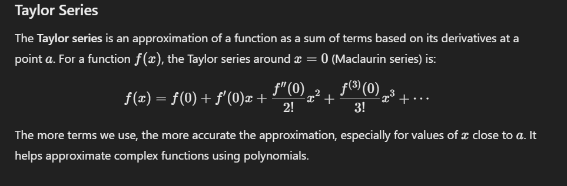
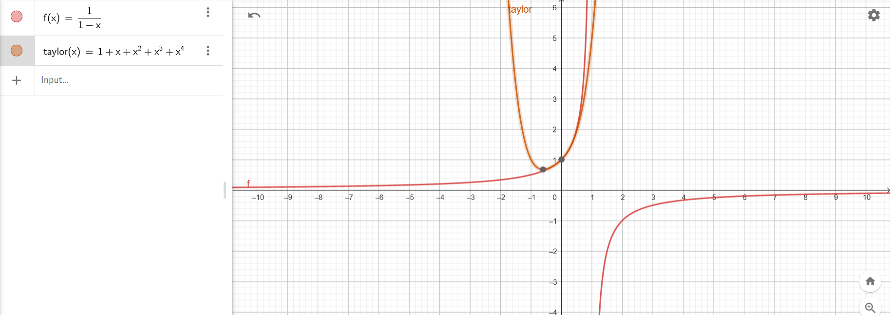
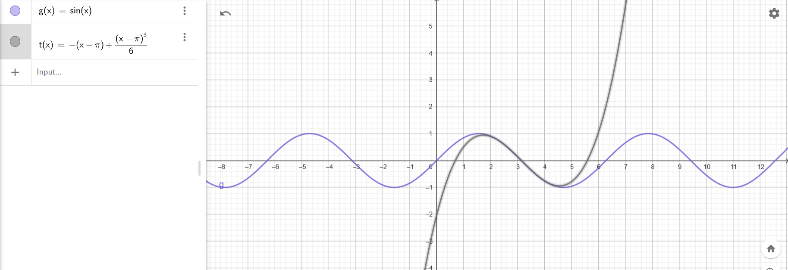
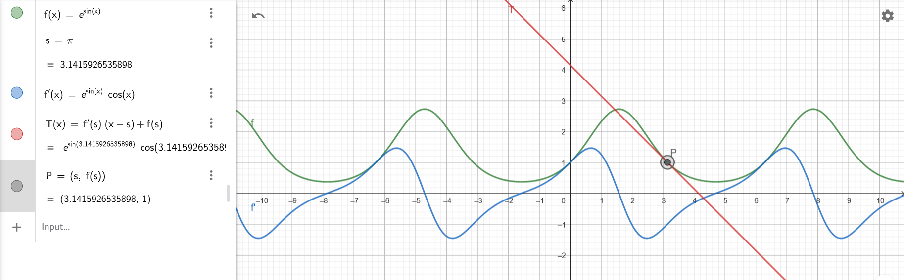
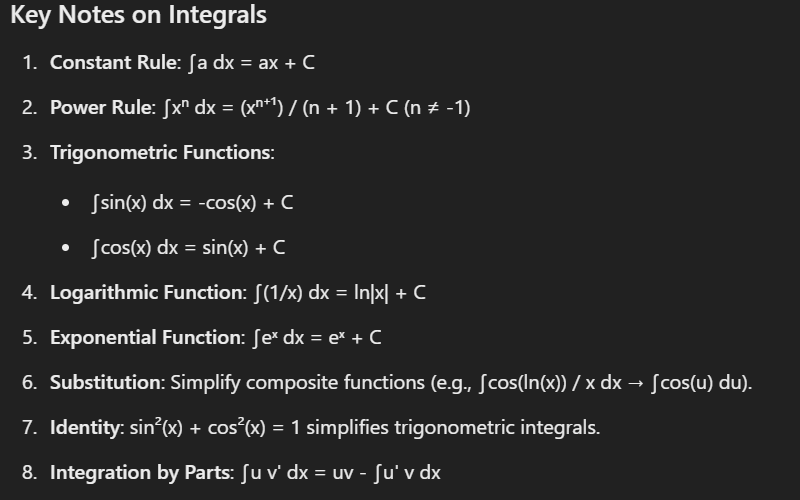
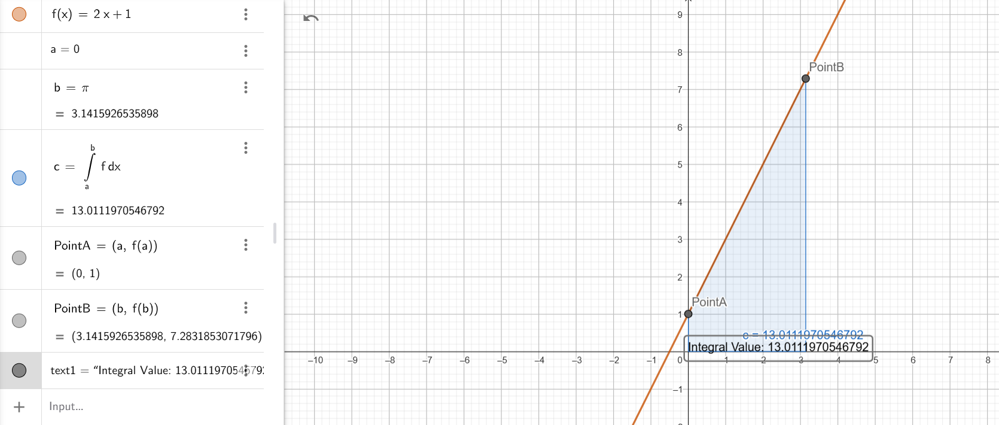
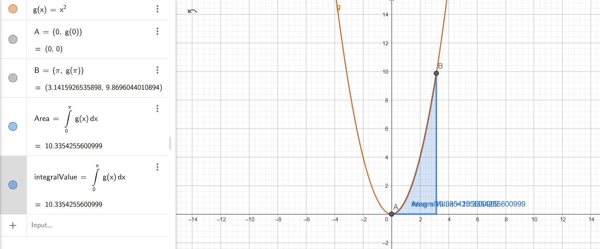

## 22. Extremum
### 6. Maximizing Profit Function P(u)
The profit function is $P(u) = -2u^2 + 50u - 300$, where $u$ is the number of units sold. Find the number of units that maximize profit.

The profit function is  $P(u) = -2u^2 + 50u - 300$.

#### Step 1: Differentiate P(u):
$$
P'(u) = -4u + 50
$$

#### Step 2: Find the critical points:
Set P'(u) = 0 :
$-4u + 50 = 0 \quad \implies \quad u = \frac{50}{4} = 12.5$

#### Step 3: Verify maximum:
The second derivative is:
$P''(u) = -4$
Since P''(u) < 0, the function has a **maximum** at u = 12.5

#### Final Answer:
The profit is maximized when $\mathbf{u = 12.5}$ units are sold.

---

### 7. Largest Rectangle Enclosed by 10m String
 You have 10 meters of string, and you need to use it to enclose the largest possible rectangular. Find the dimensions of the rectangle.
 

The string forms the **perimeter** of the rectangle. Let the dimensions of the rectangle be x (length) and y (width).

#### Step 1: Perimeter equation:
$2x + 2y = 10 \quad \implies \quad x + y = 5 \quad \implies \quad y = 5 - x$

#### Step 2: Area of the rectangle:
$A = x \cdot y = x(5 - x) = 5x - x^2$

#### Step 3: Differentiate A(x):
$A'(x) = 5 - 2x$

#### Step 4: Find the critical points:
Set  A'(x) = 0 :
$5 - 2x = 0 \quad \implies \quad x = \frac{5}{2} = 2.5$

#### Step 5: Verify maximum:
The second derivative is:
$A''(x) = -2$
Since $A''(x) < 0$, the function has a **maximum** at x = 2.5

#### Final Answer:
The dimensions of the rectangle are $\mathbf{x = 2.5 \, m}$ and $\mathbf{y = 2.5 \, m}$ (a square).

---

### 8. Extremum of $f(x) = x^2 + 3x - 5$
Find extremum od $f(x) = x^2 + 3x - 5$.

#### Step 1: Differentiate f(x):
$f'(x) = 2x + 3$

#### Step 2: Find critical points:
Set $f'(x) = 0$:
$2x + 3 = 0 \quad \implies \quad x = -\frac{3}{2}$

#### Step 3: Verify minimum:
The second derivative is:
$f''(x) = 2$
Since $f''(x) > 0$, the function has a **minimum** at $x = -\frac{3}{2}$.

#### Final Answer:
The minimum value of \(f(x)\) is:
$f\left(-\frac{3}{2}\right) = \left(-\frac{3}{2}\right)^2 + 3\left(-\frac{3}{2}\right) - 5 = \frac{9}{4} - \frac{9}{2} - 5 = -\frac{29}{4}$

The minimum occurs at $\mathbf{x = -\frac{3}{2}}$, with $\mathbf{f(x) = -\frac{29}{4}}$.

---

### 9. Extremum of $f(x) = \frac{x^2 + 2x + 1}{x - 1}$
 Find extremum of $f(x) =\frac{x^2+2x+1}{x-1}$.
 

#### Step 1: Simplify f(x):
Factor the numerator:
$f(x) = \frac{(x + 1)^2}{x - 1}$

#### Step 2: Differentiate f(x) using the quotient rule:
$f'(x) = \frac{(x - 1) \cdot 2(x + 1) - (x + 1)^2 \cdot 1}{(x - 1)^2}$
Simplify the numerator:
$f'(x) = \frac{2(x + 1)(x - 1) - (x + 1)^2}{(x - 1)^2} = \frac{2x^2 - 2 - x^2 - 2x - 1}{(x - 1)^2}$
$f'(x) = \frac{x^2 - 2x - 3}{(x - 1)^2}$

#### Step 3: Find critical points:
Set $f'(x) = 0$:
$x^2 - 2x - 3 = 0 \quad \implies \quad (x - 3)(x + 1) = 0$
$x = 3 \quad \text{or} \quad x = -1$

#### Step 4: Verify extremum:
For x = 3 and x = -1, check the second derivative or test intervals to confirm maximum or minimum. Exclude x = 1 because it causes division by zero.

#### Final Answer:
The critical points are $\mathbf{x = 3}$ and $\mathbf{x = -1}$. Substitute these into $f(x)$ to find the corresponding extremum values:
$f(3) = \frac{(3 + 1)^2}{3 - 1} = \frac{16}{2} = 8, \quad f(-1) = \frac{(-1 + 1)^2}{-1 - 1} = 0$

Extremum values are f(3) = 8 (maximum) and f(-1) = 0 (minimum).

## 23. Taylor Series

1. Find the Taylor series and visualize obtained functions in Geogebra:
- $f(x) = \cos(x)$ around $x = 0$ up to the 4th degree.

### Taylor Series of $f(x) = \cos(x)$ around $x = 0$ up to the 4th degree

To find the Taylor series of $f(x) = \cos(x)$ around $x = 0$ up to the 4th degree, follow these steps:

#### 1. Find the derivatives of $f(x) = \cos(x)$:
- $f(x) = \cos(x)$
- $f'(x) = -\sin(x)$
- $f''(x) = -\cos(x)$
- $f^{(3)}(x) = \sin(x)$
- $f^{(4)}(x) = \cos(x)$

#### 2. Evaluate the derivatives at $x = 0$:
- $f(0) = \cos(0) = 1$
- $f'(0) = -\sin(0) = 0$
- $f''(0) = -\cos(0) = -1$
- $f^{(3)}(0) = \sin(0) = 0$
- $f^{(4)}(0) = \cos(0) = 1$

#### 3. Write the Taylor series formula:
The Taylor series around $x = 0$ is given by:
$f(x) = f(0) + f'(0) \frac{x}{1!} + f''(0) \frac{x^2}{2!} + f^{(3)}(0) \frac{x^3}{3!} + f^{(4)}(0) \frac{x^4}{4!} + \cdots$

#### 4. Substitute the values into the series:
Substitute the derivatives evaluated at $x = 0$ into the formula:
$f(x) = 1 + 0 \cdot \frac{x}{1!} - 1 \cdot \frac{x^2}{2!} + 0 \cdot \frac{x^3}{3!} + 1 \cdot \frac{x^4}{4!}.$

Simplify:
$f(x) = 1 - \frac{x^2}{2} + \frac{x^4}{24}.$

#### Conclusion:
The Taylor series of $\cos(x)$ around $x = 0$ up to the 4th degree is:
$cos(x)\approx 1 - \frac{x^2}{2} + \frac{x^4}{24}$

https://www.geogebra.org/calculator/qtjafubg

- $h(x) = 1/(1-x)$ around $x = 0$ up to the 4rd degree.
### Taylor Series of $h(x) = \frac{1}{1 - x}$ around $x = 0$ up to the 4th degree

To find the Taylor series of $h(x) = \frac{1}{1 - x}$ around $x = 0$ up to the 4th degree, follow these steps:

#### 1. Find the derivatives of $h(x) = \frac{1}{1 - x}$:
- $h(x) = \frac{1}{1 - x}$
- $h'(x) = \frac{1}{(1 - x)^2}$
- $h''(x) = \frac{2}{(1 - x)^3}$
- $h^{(3)}(x) = \frac{6}{(1 - x)^4}$
- $h^{(4)}(x) = \frac{24}{(1 - x)^5}$

#### 2. Evaluate the derivatives at $x = 0$:
- $h(0) = \frac{1}{1 - 0} = 1$
- $h'(0) = \frac{1}{(1 - 0)^2} = 1$
- $h''(0) = \frac{2}{(1 - 0)^3} = 2$
- $h^{(3)}(0) = \frac{6}{(1 - 0)^4} = 6$
- $h^{(4)}(0) = \frac{24}{(1 - 0)^5} = 24$

#### 3. Write the Taylor series formula:
The Taylor series around $x = 0$ is given by:
$h(x) = h(0) + h'(0) \frac{x}{1!} + h''(0) \frac{x^2}{2!} + h^{(3)}(0) \frac{x^3}{3!} + h^{(4)}(0) \frac{x^4}{4!} + \cdots$

#### 4. Substitute the values into the series:
Substitute the derivatives evaluated at $x = 0$ into the formula:
$h(x) = 1 + 1 \cdot \frac{x}{1!} + 2 \cdot \frac{x^2}{2!} + 6 \cdot \frac{x^3}{3!} + 24 \cdot \frac{x^4}{4!}$

Simplify:
$h(x) = 1 + x + x^2 + x^3 + x^4$

#### Conclusion:
The Taylor series of $\frac{1}{1 - x}$ around $x = 0$ up to the 4th degree is:
$h(x) \approx 1 + x + x^2 + x^3 + x^4$

https://www.geogebra.org/calculator/xcnegeya

- $g(x) = \sin(x)$ around $x = \pi$ up to the 4rd degree.

### Taylor Series of $g(x) = \sin(x)$ around $x = \pi$ up to the 4th degree

To find the Taylor series of $g(x) = \sin(x)$ around $x = \pi$ up to the 4th degree, follow these steps:

#### 1. Find the derivatives of $g(x) = \sin(x)$:
- $g(x) = \sin(x)$
- $g'(x) = \cos(x)$
- $g''(x) = -\sin(x)$
- $g^{(3)}(x) = -\cos(x)$
- $g^{(4)}(x) = \sin(x)$

#### 2. Evaluate the derivatives at $x = \pi$:
- $g(\pi) = \sin(\pi) = 0$
- $g'(\pi) = \cos(\pi) = -1$
- $g''(\pi) = -\sin(\pi) = 0$
- $g^{(3)}(\pi) = -\cos(\pi) = 1$
- $g^{(4)}(\pi) = \sin(\pi) = 0$

#### 3. Write the Taylor series formula:
The Taylor series of $g(x)$ around $x = \pi$ is given by:
$g(x) = g(\pi) + g'(\pi) \frac{x - \pi}{1!} + g''(\pi) \frac{(x - \pi)^2}{2!} + g^{(3)}(\pi) \frac{(x - \pi)^3}{3!} + g^{(4)}(\pi) \frac{(x - \pi)^4}{4!} + \cdots$

#### 4. Substitute the values into the series:
Substitute the derivatives evaluated at $x = \pi$ into the formula:
$g(x) = 0 + (-1) \cdot \frac{x - \pi}{1!} + 0 \cdot \frac{(x - \pi)^2}{2!} + 1 \cdot \frac{(x - \pi)^3}{3!} + 0 \cdot \frac{(x - \pi)^4}{4!}.$

Simplify:
$g(x) = - (x - \pi) + \frac{(x - \pi)^3}{6}.$

#### Conclusion:
The Taylor series of $g(x) = \sin(x)$ around $x = \pi$ up to the 4th degree is:
$g(x) \approx - (x - \pi) + \frac{(x - \pi)^3}{6}.$

https://www.geogebra.org/calculator/x95nfj2q

2. Find a tangent line $y = f'(x_0) (x-x_0) + f(x_0)$ to the function $f(x) = e^{\sin(x)}$ at $x_0 = \pi$. Hints for Geogebra visualization: define f(x), include slider s, define y = f'(s) (x-s) + f(s), and include point P(s, f(s)).

### Tangent Line to $f(x) = e^{\sin(x)}$ at $x_0 = \pi$

We are tasked with finding the equation of the tangent line to the function $f(x) = e^{\sin(x)}$ at the point $x_0 = \pi$.

#### 1. Find the derivative of $f(x)$:

We differentiate $f(x) = e^{\sin(x)}$ using the chain rule:

$$f'(x) = e^{\sin(x)} \cdot \cos(x)$$

#### 2. Evaluate the derivative at $x_0 = \pi$:

Substitute $x_0 = \pi$ into the derivative:

$$f'(\pi) = e^{\sin(\pi)} \cdot \cos(\pi)$$

Since $\sin(\pi) = 0$ and $\cos(\pi) = -1$, we get:

$$f'(\pi) = e^0 \cdot (-1) = -1$$

#### 3. Find $f(\pi)$:

Now, evaluate the function at $x_0 = \pi$:

$$f(\pi) = e^{\sin(\pi)} = e^0 = 1$$

#### 4. Equation of the Tangent Line:

The general formula for the equation of the tangent line to the function $f(x)$ at $x_0$ is:

$$y = f'(x_0)(x - x_0) + f(x_0)$$

Substitute $f'(\pi) = -1$, $f(\pi) = 1$, and $x_0 = \pi$ into the formula:

$$y = -1(x - \pi) + 1$$

Simplify the equation:

$$y = -x + \pi + 1$$

Thus, the equation of the tangent line to the function $f(x) = e^{\sin(x)}$ at $x_0 = \pi$ is:

$$y = -x + \pi + 1$$

### Conclusion:

The tangent line to the curve $f(x) = e^{\sin(x)}$ at $x_0 = \pi$ is:

$$y = -x + \pi + 1$$

https://www.geogebra.org/calculator/jvwc2dkw

## 24. Integrals

### 1. Compute:

1. $\int 1 \, dx$  
   **Solution:**  
   $x + C$

2. $\int (x^2 + 2) \, dx$  
   **Solution:**  
   $\frac{x^3}{3} + 2x + C$

3. $\int 2\sin(x) \, dx$  
   **Solution:**  
   $-2\cos(x) + C$

4. $\int \frac{3}{x} \, dx$  
   **Solution:**  
   $3\ln|x| + C$

5. $\int \frac{1}{x^2} \, dx$  
   **Solution:**  
   $-\frac{1}{x} + C$

6. $\int \left( \frac{1}{3}x^4 - 5 \right) \, dx$  
   **Solution:**  
   $\frac{1}{15}x^5 - 5x + C$

7. $\int (\sin^2 x + \cos^2 x) \, dx$  
   **Solution:**  
   $x + C$  
   *(Using the Pythagorean identity $\sin^2 x + \cos^2 x = 1$.)*

8. $\int (5 \sin x + 3e^x) \, dx$  
   **Solution:**  
   $-5\cos(x) + 3e^x + C$

9. $\int \sqrt[3]{x} \, dx$  
   **Solution:**  
   $\frac{3}{4}x^{4/3} + C$

10. $\int \sqrt{10x} \, dx$  
    **Solution:**  
    $\frac{2}{3}(10x)^{3/2} + C$

11. $\int \cos\left(\frac{5}{2}x + 3\right) \, dx$  
    **Solution:**  
    $\frac{2}{5}\sin\left(\frac{5}{2}x + 3\right) + C$

12. $\int \frac{\cos(\ln(x))}{x} \, dx$  
    **Solution:**  
    $\sin(\ln(x)) + C$

13. $\int x \ln(x) \, dx$  
    **Solution:**  
    $\frac{x^2}{2} \ln(x) - \frac{x^2}{4} + C$

14. $\int x e^x \, dx$  
    **Solution:**  
    $(x - 1)e^x + C$

### 2. Calculate integrals over the interval $[0, \pi]$ and visualize them in Geogebra:

### 1. $f(x) = 2x + 1$

https://www.geogebra.org/calculator/vgnzgbwe

**Integral:**  
$\int_0^\pi (2x + 1) \, dx$

**Solution:**  
First, compute the indefinite integral:  
$\int (2x + 1) \, dx = x^2 + x + C$

Now, evaluate the definite integral:  
$\int_0^\pi (2x + 1) \, dx = \left[ x^2 + x \right]_0^\pi$  
$= (\pi^2 + \pi) - (0^2 + 0)$  
$= \pi^2 + \pi$

**Result:**  
$\int_0^\pi (2x + 1) \, dx = \pi^2 + \pi$

---

### 2. $g(x) = x^2$

https://www.geogebra.org/calculator/wdmr7yuj

**Integral:**  
$\int_0^\pi x^2 \, dx$

**Solution:**  
First, compute the indefinite integral:  
$\int x^2 \, dx = \frac{x^3}{3} + C$

Now, evaluate the definite integral:  
$\int_0^\pi x^2 \, dx = \left[ \frac{x^3}{3} \right]_0^\pi$  
$= \frac{\pi^3}{3} - \frac{0^3}{3}$  
$= \frac{\pi^3}{3}$

**Result:**  
$\int_0^\pi x^2 \, dx = \frac{\pi^3}{3}$

### 3. Calculate the area of the region bounded by the lines:
$x = 1$, $x = 2$, $y = 0$, and $y = x^2 + 1$. Show it in Geogebra.

## Area of the Region Bounded by the Curves

We are tasked with calculating the area of the region bounded by the lines:
- $x = 1$
- $x = 2$
- $y = 0$
- $y = x^2 + 1$

### Step 1: Set up the Integral

The area of the region can be found by integrating the difference between the upper curve ($y = x^2 + 1$) and the lower curve ($y = 0$), from $x = 1$ to $x = 2$.

Thus, the area $A$ is given by the integral:

$$ A = \int_{1}^{2} (x^2 + 1) \, dx $$

### Step 2: Compute the Integral

To solve the integral:

$$ A = \int_{1}^{2} (x^2 + 1) \, dx $$

First, integrate each term:

$$ \int x^2 \, dx = \frac{x^3}{3} $$  
$$ \int 1 \, dx = x $$

Now, apply the limits of integration:

$$ A = \left[\frac{x^3}{3} + x \right]_{1}^{2} $$

### Step 3: Evaluate the Definite Integral

Substitute the upper and lower limits:

- At $x = 2$:
  $$ \frac{2^3}{3} + 2 = \frac{8}{3} + 2 = \frac{8}{3} + \frac{6}{3} = \frac{14}{3} $$

- At $x = 1$:
  $$ \frac{1^3}{3} + 1 = \frac{1}{3} + 1 = \frac{1}{3} + \frac{3}{3} = \frac{4}{3} $$

Now, subtract the two results:

$$ A = \frac{14}{3} - \frac{4}{3} = \frac{10}{3} $$

### Step 4: Conclusion

The area of the region is:

$$ A = \frac{10}{3} $$

Thus, the area of the region bounded by the lines $x = 1$, $x = 2$, $y = 0$, and $y = x^2 + 1$ is $\frac{10}{3}$ square units.
